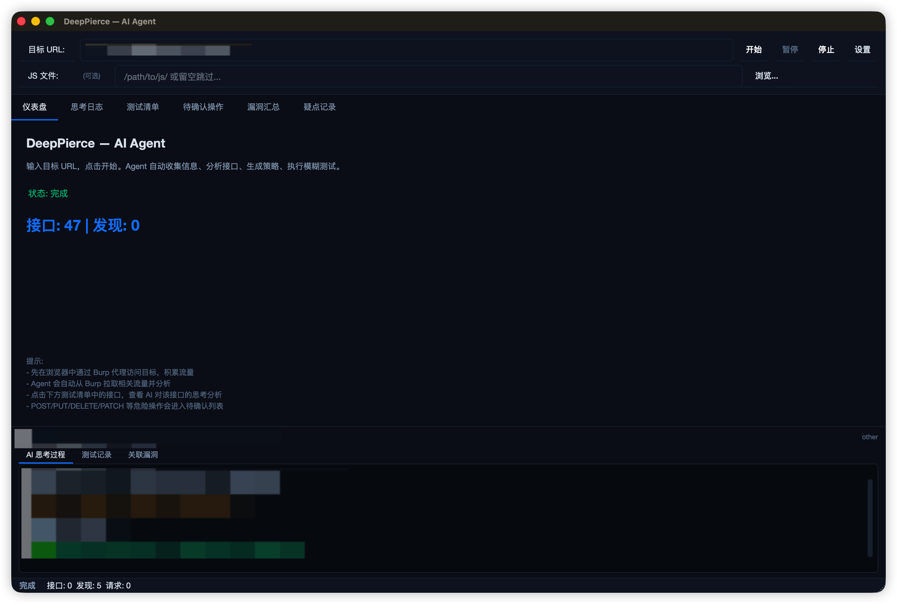
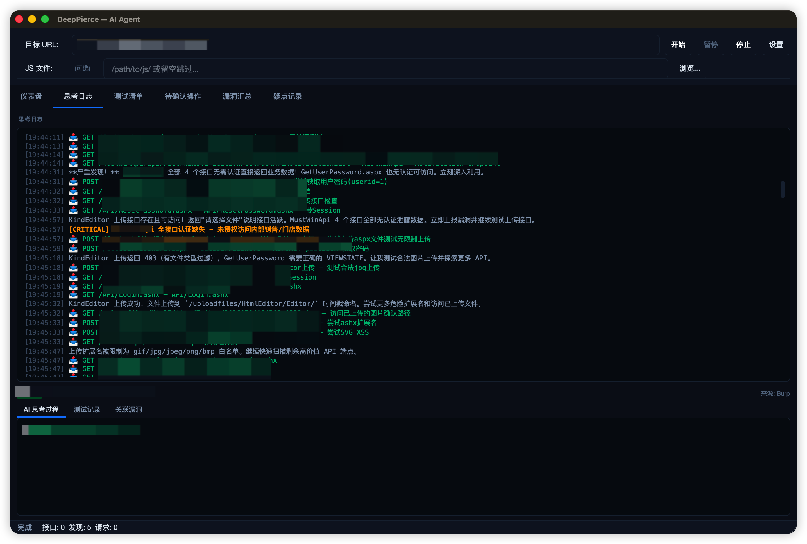
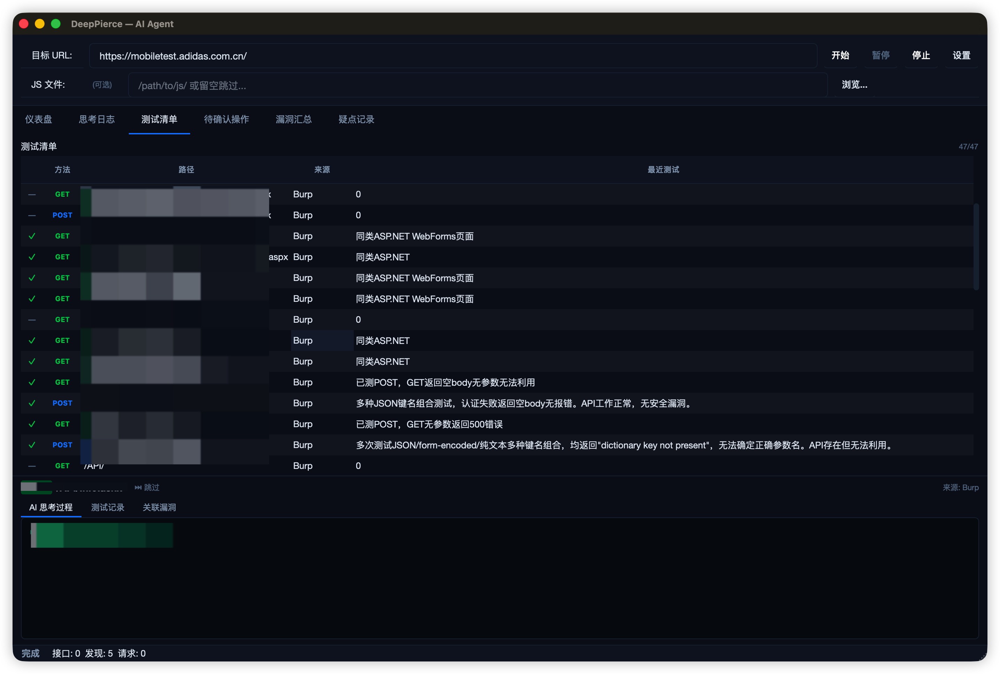
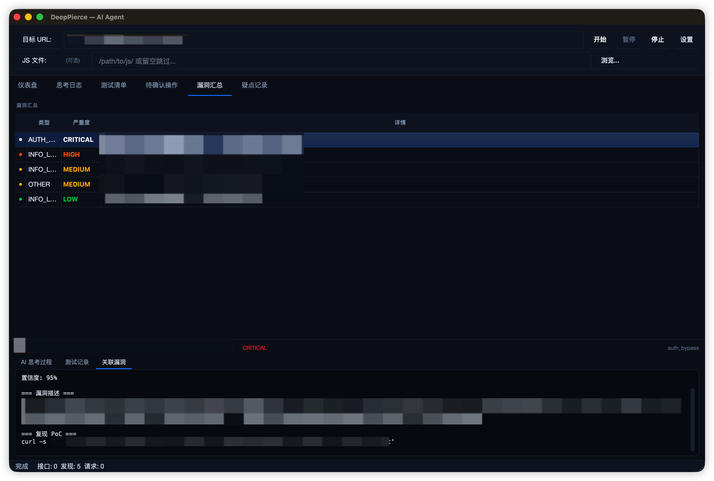

# DeepPierce — AI-Powered API Penetration Testing

AI Agent 驱动的接口模糊测试工具。自动提取接口，理解业务语义，智能生成攻击策略，逐接口深度测试。

## 安装

```bash
git clone https://github.com/lhhbb5379-stack/deeppierce.git
cd deeppierce
pip install -e .
```

**前置条件：**
- Python ≥ 3.11
- [Burp Suite](https://portswigger.net/burp) + [BurpMCP-Ultra](https://github.com/xiaoxiaoranxxx/BurpMCP-Ultra) 扩展
- [Anthropic API Key](https://console.anthropic.com)（支持自定义端点）

## 快速开始

```bash
deeppierce
```

1. 点右上角**设置**，填入 Anthropic API Key 和 Burp 连接信息
2. 浏览器通过 Burp 代理访问目标网站，积累流量
3. 输入目标 URL，点**开始**，Agent 自动工作



---

## 功能详解

### 1. 智能接口发现

**BurpMCP 流量拉取：** Agent 启动后自动从 Burp 拉取代理历史和站点地图，提取该域名下所有已发现的接口。

**JS 接口提取：** 支持选择 JS 文件目录，启动前预处理——从 JavaScript 代码中提取隐藏 API 端点、baseURL、WebService 地址、硬编码密钥。

**自动过滤：** 图片、CSS、字体、地图文件等静态资源自动跳过，不进入测试清单。JS 文件保留（可能含隐藏接口或密钥）。


### 2. 三大分析引擎

**敏感信息检测** — 数百条规则，自动从 HTTP 响应正文、头部、URL 中检测：
- 云服务密钥（AWS/Aliyun/Tencent/GitHub/GitLab/Stripe/Slack）
- JWT Token、Bearer Token、Basic Auth、API Key
- 数据库连接串（JDBC/MongoDB/Redis）
- 企业应用凭证（企业微信/钉钉/飞书 Webhook）
- 个人信息（身份证/手机号/邮箱/内网 IP）
- 私钥（RSA/EC/OpenSSH/PGP）
- 支持在设置中追加自定义规则


**参数字典** — 从 Burp 流量中自动学习：
- 高频参数名、路径段、参数值
- JSON 递归遍历提取嵌套 key
- 为 JS 提取的裸路径（无参数）提供 Fuzz 参数来源
- 测试每个接口时可查 `lookup_params` 获取原始参数和凭证

### 3. AI Agent

**理解业务语义** — 不无脑套 payload。Agent 分析每个接口的路径名、参数名来判断业务功能，再决定测什么。

**端点打分排序** — 所有接口按风险评分（路径特征 + 来源 + 方法 + 认证）从高到低排列。JS 提取的隐藏接口、管理类接口自动排前面。

**逐接口深度测试** — 以未授权访问、越权（IDOR）为最高优先级，每个接口附带 suggested_tests 建议。

**凭证复用** — 从 Burp 流量中提取的 Cookie/Token 等凭证，遇到需认证的接口自动复用，而非直接跳过。

**禁止提前收工** — `task_done` 调用时检查 pending 数，不为 0 拒绝结束，强制 Agent 继续测试。



### 4. 测试清单

**实时追踪：** 每个接口显示测试状态（待测/测试中/已测/跳过）、最近测试说明、关联漏洞数。

**点击查看详情：** 点击任意接口，底部面板显示：
- **AI 思考过程** — Agent 对该接口的所有分析思考（按接口路径自动关联）
- **测试记录** — 所有 `send_request` 和 `mark_endpoint` 的时间线
- **关联漏洞** — 该接口发现的漏洞



### 5. 漏洞汇总

按严重程度（Critical → High → Medium → Low → Info）降序排列，每条含 curl PoC。点击显示完整漏洞详情。


---

## 配置说明

配置保存在 `~/.deeppierce/config.yml`：

```yaml
api_key: "sk-ant-..."
model: "claude-sonnet-4-6"
burp_proxy: "http://127.0.0.1:8080"
burp_mcp_url: "http://127.0.0.1:9876/sse"
proxy_enabled: true
burp_mcp_enabled: true
agent_custom_prompt: ""     # Agent 行为定制
custom_api_patterns: ""     # 自定义 API 提取正则（一行一个）
custom_secret_rules: ""     # 自定义敏感信息规则（名称|正则|严重程度|类别）
```

也可通过环境变量设置：`ANTHROPIC_API_KEY`、`ANTHROPIC_BASE_URL`、`ANTHROPIC_MODEL`

---

## 项目结构

```
DeepPierce/
├── agent/          # AI Agent 核心（提示词 / 工具定义 / 主循环）
├── bridge/         # BurpMCP SSE 客户端
├── crawler/        # JS 接口提取器（FindSomething + 雪瞳风格）
├── enrich/         # 三大引擎（敏感信息正则 / 指纹规则 / Fuzz 字典）
├── gui/            # PySide6 图形界面
│   ├── widgets/    # UI 组件（端点列表 / 详情面板 / 漏洞表 / 设置等）
│   └── workers/    # 后台线程（Agent Worker）
├── config.py       # 配置管理
├── models.py       # 数据模型
└── main.py         # 入口
```

## License

MIT
